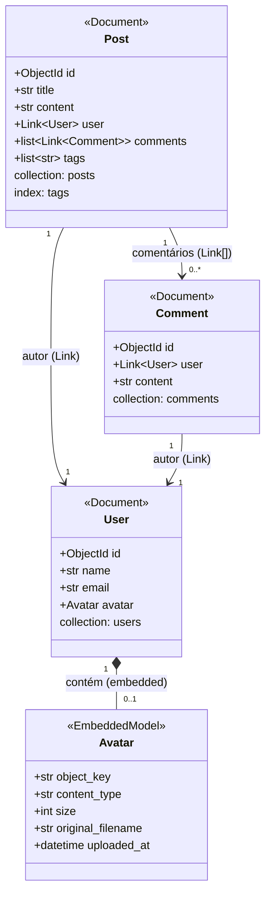

# Blog API — FastAPI + MongoDB (Beanie) + MinIO

API REST de um blog simples construída com **FastAPI**, **MongoDB** via ODM **Beanie** e armazenamento de arquivos com **MinIO**, tudo orquestrado com **Docker Compose**.

## Visão Geral

A aplicação expõe endpoints para gerenciar **usuários**, **posts** e **comentários**, além de permitir o upload e download de **avatares** dos usuários armazenados no MinIO (compatível com S3).

## Tecnologias

| Componente | Tecnologia |
|---|---|
| Framework web | FastAPI |
| ODM (banco de dados) | Beanie (Motor + PyMongo assíncrono) |
| Banco de dados | MongoDB 8.3 |
| Armazenamento de arquivos | MinIO (S3-compatible) |
| Cliente S3 assíncrono | aioboto3 |
| Paginação | fastapi-pagination |
| Containerização | Docker / Docker Compose |
| Gerenciador de pacotes | uv |

## Diagrama de Classes



## Endpoints

### Usuários (`/users`)

| Método | Rota | Descrição |
|---|---|---|
| `GET` | `/users/` | Lista todos os usuários (paginado) |
| `GET` | `/users/{id}` | Retorna um usuário pelo ID |
| `POST` | `/users/` | Cria um novo usuário |
| `PUT` | `/users/{id}` | Atualiza um usuário |
| `DELETE` | `/users/{id}` | Remove um usuário |
| `POST` | `/users/{id}/avatar` | Faz upload do avatar (JPEG, PNG, WebP, máx. 5 MB) |
| `GET` | `/users/{id}/avatar` | Baixa o avatar do usuário |
| `DELETE` | `/users/{id}/avatar` | Remove o avatar do usuário |

### Posts (`/posts`)

| Método | Rota | Descrição |
|---|---|---|
| `GET` | `/posts/` | Lista todos os posts (paginado, com links resolvidos) |
| `GET` | `/posts/{id}` | Retorna um post com usuário e comentários |
| `POST` | `/posts/` | Cria um novo post |
| `POST` | `/posts/{id}/comments/` | Adiciona um comentário ao post |
| `DELETE` | `/posts/{id}` | Remove um post |

### Tags (`/tags`)

| Método | Rota | Descrição |
|---|---|---|
| `GET` | `/tags/` | Lista todas as tags distintas (paginado) |
| `GET` | `/tags/{tag}/posts` | Lista posts que contêm a tag (paginado) |

## Estrutura do Projeto

```
.
├── main.py              # Entrypoint FastAPI (lifespan, routers)
├── modelos.py           # Documentos Beanie e modelos Pydantic
├── database.py          # Conexão e inicialização do MongoDB
├── storage.py           # Integração MinIO via aioboto3
├── rotas/
│   ├── home.py
│   ├── users.py         # CRUD de usuários + upload de avatar
│   ├── posts.py         # CRUD de posts + comentários
│   └── tags.py          # Listagem de tags e posts por tag
├── Dockerfile
├── docker-compose.yml
├── pyproject.toml
└── .env-exemplo-docker.txt
```

## Como Executar

### Pré-requisitos

- Docker e Docker Compose instalados

### 1. Criar os volumes nomeados

```bash
docker volume create blog_mongo_data
docker volume create blog_minio_data
```

### 2. Configurar variáveis de ambiente

Copie o arquivo de exemplo e ajuste as credenciais:

```bash
cp .env-exemplo-docker.txt .env
```

Conteúdo padrão do `.env` para Docker:

```env
DATABASE_URL="mongodb://mongo:27017"
DBNAME="blog"
MINIO_ENDPOINT_URL="http://minio:9000"
MINIO_ACCESS_KEY="minioadmin"
MINIO_SECRET_KEY="minioadmin"
MINIO_BUCKET="avatars"
```

### 3. Subir os containers

```bash
docker compose up --build
```

### 4. Acessar a documentação interativa

- **Swagger UI:** http://localhost:8000/docs
- **ReDoc:** http://localhost:8000/redoc
- **Console MinIO:** http://localhost:9001

## Execução Local (sem Docker)

Crie um `.env` baseado em `.env-exemplo-localhost.txt` apontando para instâncias locais do MongoDB e MinIO, depois execute:

```bash
uv run fastapi dev main.py
```
